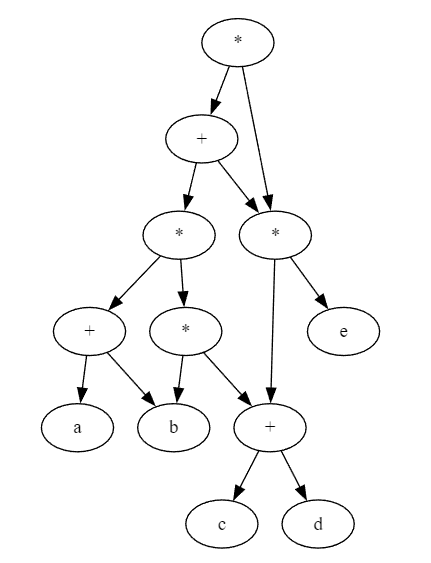

## 6.1 图的概念

1. 图的定义

    图G由顶点集V和边集E组成，即为$G=(V, E)$。其中$V(G)$表示顶点的有限非空集，$E(G)$表示顶点之间的边集合。若$V=\{v_1,v_2,\dots,v_n\}$，则$|V|$表示图中顶点的个数，$E=\{(u,v)|u\in V, v\in V\}$，用$|E|$表示边的条数。

    **注意**：图不能是空图。但可以有顶点无边。

2. 有向图

    若$E$是**有向边**的有限集合时，则图G为有向图，一个有向边可以表示为$<u,v>$，此时$u$为起点，$v$为终点，代表$u$指向$v$。

3. 无向图

    若$E$是**无向边**则图G为无向图。一个无向边可以表示为$(u,v)$

4. 简单图、多重图

    一个图G如果满足

    1. 不存在重边
    2. 不存在指向自身的边

    那么称G为**简单图**，否则则为**多重图**。

5. 完全图

    对于**无向图**，$|E|$的取值为0~$n(n-1)/2$，有$n(n-1)/2$条边的**无向图**为**完全图**，即任意两个顶点间都存在边。

    对于**有向图**，若任意两个顶点都存在两条方向相反的边则为**有向完全图**。

6. 子图

    如果$E'$为$E$的子集，$V'$为$V$的子集，则图$G'=(V', E')$为图$G=(V,E)$的子图。

    **注意**：不是$E$和$V$的任意子集都可以构成图，需要保证边子集中的点在点子集中。

7. 连通、连通图和连通分量

    在无向图中，若从顶点$v$到$w$有路径存在，则称$v$和$w$时**连通**的，若$G$中任意两个顶点**连通**，则图$G$为**连通图**，否则为**非连通图**。

    **极大连通子图**（**连通分量**）：图G中一个顶点数最多的连通子图。

8. 强连通图、强连通分量

    在有向图中，若顶点$v$到$w$和$w$到$v$之间都有路径，则称两个顶点是**强连通**的，若任意两个顶点都是**强连通**的，则图为**强连通图**。
    有向图中的**极大强连通子图**称为**强连通分量**。

    **注意**：强连通图最少边为$n-1$，即$n$个点构成一个单项环路。

9. 生成树、生成森林

    连通图的**生成树**是包含图中所有结点的一个极小连通子图。即$n$个点只有$n-1$条边。

    在连通图中，连通分量的生成树构成了非连通图的生成森林。

10. 顶点的度、入度和出度

    无向图中，顶点的度是指相连的边的条数，记为$\mathrm{TD}(v)$。

    对于$n$个顶点$e$条边的图有：

    $$
    \sum_{i=1}^{n}\mathrm{TD}(v_i) = 2e
    $$

    有向图中，指向一个顶点的边则为该顶点的**入度**，记为$\mathrm{ID}(v)$。从该顶点指向其他顶点的边数则为**出度**，记为$\mathrm{OD}(v)$。同时有$\mathrm{TD}(v)=\mathrm{ID}(v)+\mathrm{OD}(v)$。

    对于$e$条边的图有

    $$
    \sum_{i=1}^{n}\mathrm{ID}(v_i) = \sum_{i=1}^{n}\mathrm{OD}(v_i) = e
    $$

11. 边的权和网

    若为每条边加上数值，则为边的**权值**（例如长度）。带有权值的图称为**带权图**，也称**网**。

12. 稠密图、稀疏图

    边很少叫**稀疏图**，边很多为**稠密图**。多和少无具体定义，是相对其他图比较而言。

    但一般当$|E|<|V|\log{|V|}$时可视为**稀疏图**。

13. 路径、路径长度和回路

    **路径**是指从$v$到$w$的路径上的顶点序列$v,v_i,\dots,v_j,w$。路径上边的数目称为**路径长度**。

    第一个顶点和最后一个顶点相同的路径称为**回路**或**环**。若一个图有$n$个顶点，并且边满足$e>n-1$，则一定有回路。

14. 简单路径、简单回路

    在路径序列中，顶点不重复出现的路径称为**简单路径**，除第一个顶点和最后一个顶点外其他顶点不重复的回路称为**简单回路**。

15. 距离

    若存在$v$到$w$的路径，则路径长度为$v$到$w$的**距离**，若不存在任何路径，则距离可视为无穷。

16. 有向树

    一个顶点的入度为0、其余顶点入度均为1的有向树（即从根结点往下指  向），称为有向树。

## 6.2 图的存储及基本操作

1. 邻接矩阵

    用一个一维数组存储图中顶点信息。用一个二位数组存储边的信息。

    $$
    A_{ij} = \begin{cases}
        1,&v_i,v_j邻接\\
        0,&v_i,v_j不邻接
    \end{cases}
    $$

    对于带权图则可以

    $$
    A_{ij} = \begin{cases}
        w_{ij},&v_i,v_j邻接\\
        0或\infin,&v_i,v_j不邻接
    \end{cases}
    $$

    空间复杂度为$O(n^2)$，$n$为顶点数$|V|$。

    特点：

    1. 无向图的邻接矩阵一定对称，此时可以压缩为三角矩阵。
    2. 无向图邻接矩阵第i行非零元素为顶点i的度$\mathrm{TD}(v_i)$。
    3. 有向图第i行的非零元素是顶点i的出度，第i列的非零元素为顶点i的入度。
    4. 邻接矩阵可以$O(1)$确定两个顶点是否相连，但要确定边数需要按行按列全部累加。
    5. 稠密图适合邻接矩阵。
    6. 图G的邻接矩阵为$A$，则$A^n$中元素$A^n_{ij}$则为顶点i到顶点j的长度为n的路径的数目。

2. 邻接表

    对每个顶点建立一个单链表，第i个单链表中的结点表示依附于$v_i$的边，称为**边表**，

    特点：

    1. 无向图需要$O(|V|+2|E|)$空间，有向图需要$O(|V|+|E|)$空间。
    2. 稀疏图适合邻接表。
    3. 邻接表给定一个顶点很容易就能找出它的所有邻边，但确认两个顶点是否存在邻边则需要$O(n)$。
    4. 有向图中，求出度只需计算邻接表结点个数，但入度则需遍历所有边表。
    5. 邻接表不唯一，边表中结点次序可以任意。

3. 十字链表

    一种**有向图**的存储结构，每条边有一个结点，每个顶点也有一个结点。
    
    顶点结点为`data|firstin|firstout`，边结点为`tailvex|headvex|hlink|tlink|(info)`。

    `headvex`和`tailvex`分别表示弧头和弧尾，`hlink`指向下一个弧头相同的边结点，`tlink`指向下一个弧尾相邻的边结点，`info`存放相关信息。这样相同的弧头有一张链表，相同的弧尾也有一张链表。

    顶点中的`firstin`指向以该节点作为弧头的第一个边结点，`firstout`指向以该节点作为弧尾的第一个边结点。并且定点表顺序存储。

4. 邻接多重表

    一种**无向图**的存储结构。

    顶点结点为`data|firstedge`，边结点为`ivex|ilink|jvex|jlink|info`。

    `ivex`和`jvex`代表边两边的两个顶点，`ilink`、`jlink`分别指向下一条依附`ivex`、`jvex`的边结点。

    `firstedge`指向该顶点第一条边。

    此时寻找`i`和`j`是否相接则从`i`的边结点开始依次往`ilink`遍历寻找是否有`j`。

5. 基本操作

    ```cpp
    Adjacent(G, x, y)           // 判断图G是否存在边<x,y>或(x,y)
    Neighbors(G, x)             // 列出图G中与x邻接的边
    InsertVertex(G, x)          // 从图G中插入顶点x
    DeleteVertex(G, x)          // 从图G中删除顶点x
    AddEdge(G, x, y)            // 添加边(x,y)或<x, y>
    RemoveEdge(G, x, y)         // 移除边(x,y)或<x, y>
    FirstNeighbor(G, x)         // 返回顶点x的第一个邻接点，没有返回-1
    NextNeighbor(G, x, y)       // 设y是x的邻接点，返回除y之外的下一个邻接点，若y是最后一个返回-1
    GetEdgeValue(G, x, y)       // 获取边(x,y)或<x, y>的权值
    SetEdgeValue(G, x, y, v)    // 设置边(x,y)或<x, y>的权值
    ```

## 6.3 图的遍历

1. 广度优先搜索BFS

    从顶点$v$出发，依次访问未访问过的邻接顶点$w_1,w_2,\dots,w_i$，然后再依次访问$w_1,w_2,\dots,w_i$的所有未被访问过的邻接顶点，依次类推直至所有顶点都被访问。

    需要辅助队列，空间复杂度$O(|V|)$。

    采用邻接表时，每个顶点的每条边搜索一次，时间复杂度$O(|V|+|E|)$。
    采用邻接矩阵时，查找每个顶点的邻接点需要$O(|V|)$，故总时间复杂度为$O(|V|^2)$。

2. BFS解决单源最短路

    使用BFS，我们可以求解**非带权图**的单源最短路问题。

3. 广度优先生成树

    BFS中我们可以得到一棵遍历树，称为**广度优先生成树**。

    同一图的邻接矩阵存储表示是唯一的，故广度优先生成树也唯一，但邻接表存储方式不唯一，故广度优先生成树也不唯一。

4. 深度优先搜索DFS

    与BFS不同，DFS类似先序遍历，先尽可能深的访问某一个分支。

    从顶点$v$出发，访问未被访问的邻接顶点$w_1$，然后再从$w_1$继续访问一个未被访问的邻接顶点$w_2$，当不存在未被访问的邻接顶点时，退回到上一个顶点继续其他邻接顶点。

    **注意**：邻接矩阵是唯一的，故不管是BFS还是DFS的序列都唯一，但邻接表因为不是唯一的，所以不管是BFS还是DFS的序列都不唯一。

    需要递归$|V|$次，故隐式使用了一个递归工作栈，空间复杂度$O(|V|)$。

    采用邻接表时，每个顶点的每条边搜索一次，时间复杂度$O(|V|+|E|)$。
    采用邻接矩阵时，查找每个顶点的邻接点需要$O(|V|)$，故总时间复杂度为$O(|V|^2)$。

5. 深度优先生成树和生成森林

    和BFS一样，DFS也有DFS生成树，但这是有条件的，对连通图进行DFS才能是一棵DFS生成树，否则将会是DFS森林。

    同样基于邻接表存储的DFS生成树不唯一。

6. 图的遍历和连通性。

    对于无向图来说，若图是联通的，则从任意结点出发，仅需一次遍历就可以访问所有顶点。否则一次遍历只能访问到该顶点所在连通分量的所有顶点。

    对于有向图来说，强连通才能一次遍历访问所有顶点，非强连通依然可能需要多次遍历。

## 6.4 图的应用

1. 最小生成树

    包含图的所有顶点，并且只含尽可能少的边。对于生成树来说，若砍去任意一条边都会变成**非连通图**，若增加一条边则会形成回路。

    对于**带权连通无向图**，其中边权之和最小的生成树称为**最小生成树**。

    1. 无权图（或权相等）最小生成树不唯一，带权图最小生成树唯一。
    2. 最小生成树的边权之和唯一。
    3. 最小生成树边=顶点数-1

2. Prim算法

    初始任选一顶点加入树$T$，之后选择与当前$T$中顶点集合最近的顶点和相应的边加入$T$，以此类推直到所有顶点加入$T$。最后$T$就是最小生成树。

    伪代码如下

    ```cpp
    void Prim(G, T) {
        T = {};
        U = {w};
        while((V-U) != {}) {
            // 设(u,v)满足，u是U中的点，v是距离U中点最近的点
            T.push((u, v));
            U.push(v);
        }
    }
    ```

    时间复杂度$O(|V^2|)$，因为每次需要$O(|V|)$找到最近的点，需要找$O(|V|)$次。

    Prim不依赖于$|E|$，因此适合稠密图的最小生成树。

3. Kruskal算法

    初始时有n个顶点无边的非连通图$T$，然后选择最小且不在当前连通分量中的权值边加入，接下来不断选取最小权值边直到$T$为连通图为止。

    ```cpp
    void Kruskal(V, T) {
        T = V;
        nums = n;           // 连通分量数
        while(nums > 1) {
            // 设(u,v)满足E中最小的边
            if (u和v属于不同连通分量) {
                T.push((v,u));
                nums--;
            }
        }
    }
    ```

    一般我们使用堆来存储边的序列，所以每次取最小的更新代价只需要$O(log_2{|E|})$。

    总时间复杂度$O(|E|log_2{|E|})$。因此Kruskal适合**边稀疏**而顶点较多的图。

4. Dijkstra单源最短路

    求带权图的单源最短路。设源点为$v_0$，求解步骤如下

    1. 集合$S$初始化为${v_0}$，`dist[] = arcs[v0][i]`。
    2. 从顶点集合$V-S$选出$v_j$，满足`dist[j] = Min{dist[i]|vi in {V-S}}`，即源点到这个点路径最短。将该点加入$S$。
    3. 修改源点到$V-S$中顶点$v_k$的路径，`dist[k] = Min{dist[j]+arcs[j][k], dist[k]}`，即如果从$v_0$走到$v_j$再走到$v_k$比之前走到$v_k$的路径要短的话则更新。
    4. 重复2,3共n-1次，直到所有顶点都包含在S中。

    采用邻接矩阵时，时间复杂度为$O(|V|^2)$，因为每次更新$O(|V|)$个点，一共$O(|V|)$次。
    采用邻接表时，时间复杂度依然还是$O(|V|^2)$。因为步骤不变。

    **注意**：Dijkstra算法总是求源点和其他所有点的最短路，就算是只需要和特定点的最短路也依然需要$O(|V|^2)$。

    **注意**：Dijkstra算法不适用于带负权的图。（因为本质上Dijkstra是个局部贪心）

5. Floyd全顶点最短路

    求所有顶点之间的最短路。

    1. 初始化`A[i][j] = arcs[i][j]`。
    2. 将$v_0$作为中间顶点，对于所有顶点有`A[i][j] = Min{A[i][j], A[i][v0] + A[v0][j]}`，即如果先走到$v_0$再走到j更短则更新距离。
    3. 重复1，依次将$v_k$作为中间结点更新。

    最终`A`中将记录任意顶点对之间的最短路。

    时间复杂度，显然每次更新需要$O(|V|^2)$，共更新$O(|V|)$次。

    总时间复杂度$O(|V|^3)$。

6. 有向无环图（DAG）描述表达式

    DAG可以用来描述含有公共子式的表达式，之前我们学习了用二叉树描述算术表达式，但如果其中有相同子式的情况，我们可以通过一个共享指向变成DAG从而节省空间，例如
    `((a+b)*(b*(c+d))+(c+d)*e)*((c+d)*e)`

    可以描述为

    

    **注意**：遇到这种给表达式翻译还是转换都不慌，转换就是每个括号就是子树，每个运算符都是连接两个子树的根。翻译的话从任意叶结点开始，遇到运算符就加一层括号，再去翻译两个子树的内容。

7. 拓扑排序

    AOV网：在DAG中，顶点表示活动，边表示活动之间的依赖关系，则将这个DAG称为AOV网。
    拓扑排序：由DAG顶点组成的序列，每个顶点只出现一次，且若A在B前面，则代表AOV网中无B到A的路径。

    每个AOV网有一个或多个拓扑排序序列。生成方式为

    1. 从AOV网中选择一个没有前驱的顶点输出
    2. 从网中删除该顶点和以它为起点的有向边。
    3. 重复1，2直到AOV网空或不存在无前驱的顶点（此时成环）为止。

    采用邻接表存储时时间复杂度为$O(|V|+|E|)$，（因为涉及到删除边操作）。采用邻接矩阵时时间复杂度为$O(|V|^2)$。拓扑排序可以使用**DFS**实现。

    逆拓扑排序：

    1. AOV网中选择一个没有后继（出度为0）的顶点输出。
    2. 从网中删除该顶点和所有以它为终点的有向边。
    3. 重复1，2直到AOV为空。

    **注意**：若一个顶点有多个直接后继，拓扑排序的结果通常不唯一，若各个顶点已经排在一个线性有序的系列中，每个顶点有唯一后继，则拓扑排序唯一。

    **注意**：若邻接矩阵是三角矩阵，则存在拓扑序列，但存在拓扑序列不代表邻接矩阵为三角矩阵。

8. 关键路径

    在带权有向图中，以顶点表示时间，边表示活动，权值表示完成活动的开销，则称为AOE网。AOE和AOV都是DAG。

    AOE网性质：

    1. 只有在顶点所代表的事件发生后，从该顶点出发的各有向边所代表的活动才能开始。
    2. 只有在进入某顶点的各有向边结束后，该顶点事件才能发生。

    其实就是说必须按照边走，每条边都要走...

    AOE网中仅有一个入度为0的点，代表开始顶点（源点），同时仅有一个出度为0的顶点，称为结束顶点（汇点）。

    AOE中活动是可以并行的，从源点到汇点的路径可能很多条且长度不同。其中具有最大路径长度的路径称为**关键路径**。（即拖后腿的，它最后走完整个工程结束）

    1. 事件$v_k$的最早发生事件$ve(k)$

        从源点$v_1$到顶点$v_k$的最长路径长度。

        $$
        ve(v_1) = 0\\
        ve(k) = Max\{ve(j) + Weight(v_j, v_k)\}
        $$

        $v_k$为$v_j$的后继，Weight代表边权。

    2. 事件$vl(k)$的最迟发生事件

        指它在不拖延后面事件发生的情况下能最晚发生的事件，最晚事件其实就是下一件事件最晚发生事件 - 和他的边权。

        $$
        vl(v_n) = ve(v_n)\\
        vl(k) = Min\{vl(j) - Weight(v_k, v_j)\}
        $$

        $v_k$为$v_j$的前驱，Weight代表边权。

    3. 活动$a_i$的最早开始时间$e(i)$

        等同边的起点最早开始时间$e(i) = ve(k)$。

    4. 活动$a_i$的最迟开始时间$l(i)$

        等同边的终点最迟发生时间 - 该边权值，$l(i) = vl(j) - Weight(v_k, v_j)$

    5. 一个活动$a_i$的最初开始时间$l(i)$和最早开始时间$e(i)$的差值$d(i) = l(i) - e(i)$

        也就是在不影响总时间的情况下，该活动可以拖延的时间，若$l(i) - e(i) = d(i) = 0$，则该活动不能发生拖延，称为**关键活动**。

    关键路径求解如下：

    1. 从源点出发，令$ve(源点)=0$，按拓扑有序求其他顶点最早发生时间$ve(k)$
    2. 从汇点出发，令$vl(汇点) = ve(汇点)$，按逆拓扑有序求其他顶点最迟发生时间$vl(k)$。
    3. 根据各顶点$ve$计算各弧的最早开始时间$e(i)$。
    4. 根据各顶点的$vl$计算各弧的$l(i)$。
    5. 求所有活动的差值$d(i)$，找到所有$d(i) = 0$的活动构成关键路径。
